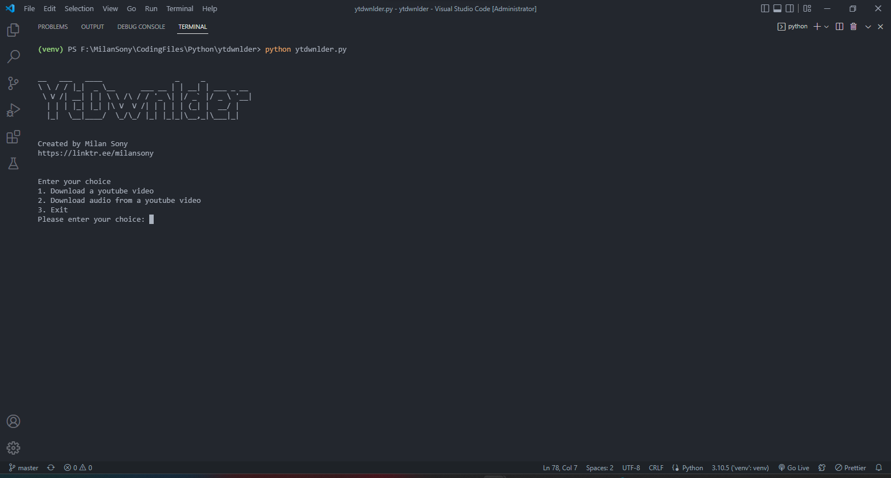

# ytdwnlder

A simple command line youtube video/audio downloader

I have read one blog on <a href = "https://dev.to/">dev.to</a> - <a href = "https://dev.to/seijind/how-to-download-youtube-videos-in-python-44od">How to Download YouTube videos in Python</a> so I thought to build the same

## Read documentation about

- <a href = "https://pytube.io/en/latest/">pytube</a>

## Libraries used

- `pytube`

## Run locally

You will need to install Python on you system, head over to https://www.python.org/downloads/ to download python.
(Dont Forget to tick `Add Python to PATH` while installing Python)

Once you have downloaded Python on your system, 
run the following command inside your terminal (only if your system is git enabled, otherwise download the zip file and extract it)

```bash
  git clone https://github.com/milan-sony/ytdwnlder.git
```

Then go to the project folder

```bash
  cd ytdwnlder
```

(This is optional, but strongly recommended) Make a virtual environment

```bash
  python -m venv venv
```

Activate the virtual environment

```bash
  venv/Scripts/activate
```

If error occurs when activating virtual environment, run the following command (after that activate the virtual environment again)

```bash
  Set-ExecutionPolicy -Scope CurrentUser -ExecutionPolicy Unrestricted
```

Then Install the dependencies needed for this project

```bash
  pip install -r requirements.txt
```

Now run the script

```bash
  python ytdwnlder.py
```

## Screenshot


